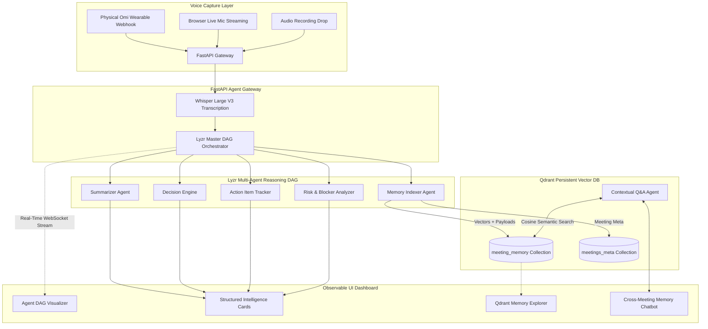

# 🎙️ MeetSight: Autonomous Voice-First Meeting Intelligence

[](https://app.hidevs.xyz/hackathons/stop-prompting-solo-agents-hackathon-2026)
[](#-system-architecture)
[](https://fastapi.tiangolo.com/)
[](https://vitejs.dev/)

> **"Speak naturally. Let autonomous agents understand, remember what matters, and retrieve that knowledge when needed."**

MeetSight is an autonomous, voice-first meeting intelligence system built for the **Stop Prompting: Code Solo Agents Hackathon 2026** (organized by **HiDevs** with **Lyzr × Qdrant × Omi**).

Moving beyond single-prompt chatbots and basic transcription tools, MeetSight executes an observable multi-agent reasoning DAG and persists long-term semantic memory in a vector database to enable true cross-meeting recall.

---

## 🌟 The Mandatory Technology Triad

Every aspect of MeetSight directly maps to the hackathon's core architecture requirements:

```
                      +-----------------------------+
                      |   1. OMI (Voice Capture)    |
                      |  Ambient Device & Live Mic  |
                      +--------------+--------------+
                                     |
                                     v
                      +-----------------------------+
                      | 2. LYZR (Agent Orchestrator)|
                      |    Observable Multi-Agent   |
                      |        Reasoning DAG        |
                      +--------------+--------------+
                                     |
                                     v
                      +-----------------------------+
                      |  3. QDRANT (Vector Memory)  |
                      |    Persistent Multi-Meeting |
                      |       Semantic Retrieval    |
                      +-----------------------------+
```

| Technology | Role in MeetSight | Architecture Implementation |
| :--- | :--- | :--- |
| **Omi** | **Voice Interface ("The Ears")** | Captures live spoken conversation via physical Omi hardware webhook receiver (`/api/omi/webhook`) and companion browser microphone live audio streaming. |
| **Lyzr** | **Agent Orchestrator ("The Brain")** | Coordinates a master Directed Acyclic Graph (DAG) managing 5 specialized agents with real-time observable WebSocket execution traces. |
| **Qdrant** | **Persistent Memory ("The Memory")** | Indexes high-dimensional embeddings (`bge-small-en-v1.5`, 384-d, Cosine similarity) of transcript chunks, decisions, and action items for cross-meeting recall. |

---

## 🏗️ System Architecture



---

## 🤖 Lyzr Agent Topology & Responsibilities

MeetSight avoids generic prompts by delegating distinct cognitive tasks to specialized sub-agents:

1. **Lyzr Master Coordinator Agent**: Analyzes transcript structure, manages DAG concurrency, and streams real-time execution thoughts over WebSockets.
2. **Executive Summarizer Agent**: Synthesizes discussions into high-level executive briefings, discussion pillars, and participant sentiment.
3. **Decision Engine**: Detects consensus triggers, approved technical architecture choices, and policy resolutions.
4. **Action Item Tracker**: Identifies concrete tasks with assignees, priority levels (`high`, `medium`, `low`), and deadlines.
5. **Risk & Blocker Analyzer**: Discovers unresolved blockers, external dependencies (e.g. AWS approvals), and proposes mitigations.
6. **Qdrant Memory Indexer Agent**: Chunks transcripts, generates 384-dimensional dense vectors, and upserts payloads into Qdrant.
7. **Contextual Q&A Agent**: Answers user queries by executing semantic vector search on Qdrant across current and historical meetings with exact citations.

---

## ✨ Key Features

- **Observable Agentic Workflows**: Real-time visual DAG showing each Lyzr agent thinking, executing, and streaming output via WebSockets.
- **Persistent Cross-Meeting Memory**: Ask *"What did we decide about authentication in last week's meeting?"* and retrieve the exact decision from Qdrant.
- **Qdrant Memory Explorer**: Interactive inspector allowing users and judges to test vector similarity scores and inspect stored memory points directly.
- **Ambient Voice First**: Works with physical Omi device webhooks or live browser microphone capture.
- **Export & Portability**: Export intelligence records to Markdown, JSON, TXT, and PDF.

---

## 🚀 Quickstart & Local Setup

### Prerequisites
- **Node.js** 18+ (tested on Node v24)
- **Python** 3.10 or 3.11 (tested on Python 3.10.11)
- **Git**

---

### Step 1: Clone Repository
```bash
git clone https://github.com/DhruvPatel0110/SPSAH-26-MeetSight.git
cd SPSAH-26-MeetSight
```

---

### Step 2: Backend Setup
```bash
# Navigate to backend
cd backend

# Create virtual environment with Python 3.10
py -3.10 -m venv venv

# Activate virtual environment
# Windows PowerShell:
.\venv\Scripts\Activate.ps1
# Linux / macOS:
# source venv/bin/activate

# Install dependencies
pip install -r requirements.txt
```

---

### Step 3: Configure Environment Variables
Inside `backend/.env`:
```env
PORT=8000
HOST=127.0.0.1
CORS_ORIGINS=http://localhost:5173,http://127.0.0.1:5173

# Qdrant Persistent Vector Memory
# Leave as "local" for zero-configuration disk persistence (no Docker or cloud cluster required)
# Or set your Qdrant Cloud URL and API Key
QDRANT_URL=local
QDRANT_API_KEY=
QDRANT_STORAGE_PATH=./qdrant_storage

# LLM & Transcription Keys
GROQ_API_KEY=your_groq_api_key_here
GEMINI_API_KEY=your_gemini_api_key_here
LYZR_API_KEY=your_lyzr_api_key_here

# Omi Webhook Secret
OMI_WEBHOOK_SECRET=meetsight_omi_secret_2026
```

---

### Step 4: Frontend Setup
```bash
# In a new terminal, navigate to frontend
cd frontend

# Install dependencies
npm install
```

---

### Step 5: Run MeetSight

#### Option A: One-Click Windows Launcher
Double-click `start.bat` in the root folder, or run:
```powershell
.\start.bat
```

#### Option B: Manual Launch
**Terminal 1 (Backend):**
```bash
cd backend
.\venv\Scripts\Activate.ps1
python main.py
```
*Backend runs on `http://127.0.0.1:8000` (API docs at `http://127.0.0.1:8000/docs`).*

**Terminal 2 (Frontend):**
```bash
cd frontend
npm run dev
```
*Frontend runs on `http://localhost:5173`.*

---

## 🎬 Demo Walkthrough (5-Minute Script)

1. **Problem Statement (0:00–0:30)**: Meeting notes are manual, prompt wrappers lack memory, and decisions get lost across conversations.
2. **Architecture (0:30–1:00)**: Show the Omi $\rightarrow$ Lyzr $\rightarrow$ Qdrant $\rightarrow$ UI loop.
3. **Live Voice Capture & Observable DAG (1:00–2:30)**: Click *"Start Live Voice Capture"* (or *"Demo Sample"*) to watch the Lyzr DAG pulse in real-time as each agent reasons and extracts decisions, action items, and risks.
4. **Persistent Vector Memory (2:30–3:45)**: Open *"Qdrant Memory Explorer"*, demonstrate vector similarity search, and use the *"Cross-Meeting Memory Chatbot"* to recall a previous meeting decision.
5. **Impact & Code Quality (3:45–5:00)**: Highlight the clean monorepo architecture, FastAPI async streaming, and zero-leak vector persistence.

---

## 📂 Repository Structure

```
SPSAH-26-MeetSight/
├── backend/
│   ├── config.py                 # Environment configuration
│   ├── main.py                   # FastAPI server & WebSocket agent stream
│   ├── qdrant_storage/           # Local persistent Qdrant database directory
│   ├── requirements.txt          # Python dependencies
│   ├── services/
│   │   ├── memory_service.py     # Qdrant client, collections & FastEmbed
│   │   ├── orchestrator_service.py# Lyzr master coordinator & specialized agents
│   │   └── omi_service.py        # Omi webhook receiver & Whisper STT
│   └── test_dag.py               # E2E test script for agent DAG
├── frontend/
│   ├── src/
│   │   ├── components/
│   │   │   ├── AgentVisualizer/  # Observable Lyzr DAG Visualizer
│   │   │   ├── Omi/              # Live voice capture & Omi companion
│   │   │   ├── Memory/           # Qdrant Vector Memory Explorer Modal
│   │   │   ├── Decisions/        # Extracted Decisions Panel
│   │   │   ├── Risks/            # Risk & Blocker Analyzer Panel
│   │   │   ├── Chatbot/          # Cross-Meeting Contextual Q&A Assistant
│   │   │   ├── Dashboard/        # Master dashboard layout & header
│   │   │   ├── Transcript/       # Searchable transcript viewer
│   │   │   └── Summary/          # Executive summary cards
│   │   └── services/
│   │       └── meetsightApi.js   # Frontend API & WebSocket client
│   ├── package.json
│   └── vite.config.js            # Vite configuration with API & WS proxy
├── start.bat                     # 1-Click Windows execution script
├── phases.txt                    # Project execution phases & roadmap
└── README.md                     # Comprehensive documentation
```

---

## 🏆 Hackathon Compliance Checklist

- [x] **Solo Development**: Built independently for Stop Prompting Solo Agents Hackathon 2026.
- [x] **Omi Integration**: Dedicated webhook endpoint + live browser voice streaming companion.
- [x] **Lyzr Integration**: Multi-agent orchestration DAG with observable execution events.
- [x] **Qdrant Integration**: Persistent vector database indexing meeting chunks, decisions, and cross-meeting semantic recall.
- [x] **Observable Agentic Workflows**: Real-time visual DAG component showing agent reasoning steps.
- [x] **Working Software**: End-to-end working system verified and executable with 1-click launch.

---

**Made for SPSAH-26 | HiDevs × Lyzr × Qdrant × Omi**
