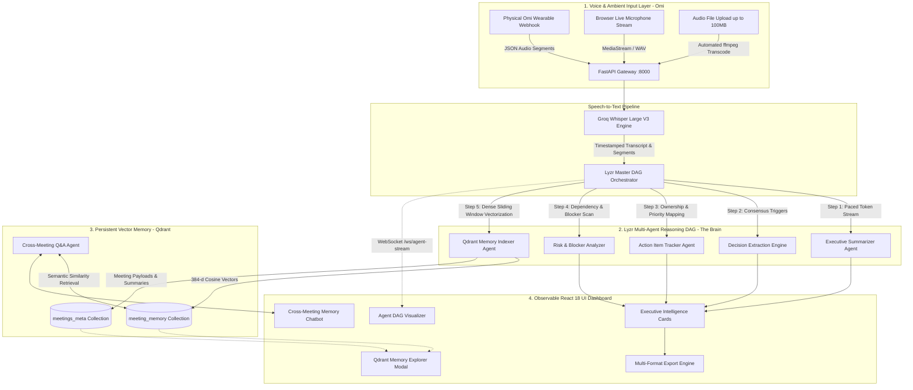

# 🎙️ MeetSight: Autonomous Voice-First Meeting Intelligence

<div align="center">

[](https://app.hidevs.xyz/hackathons/stop-prompting-solo-agents-hackathon-2026)
[](https://hidevs.xyz/)
[](https://github.com/DhruvPatel0110/SPSAH-26-MeetSight)
[](https://app.hidevs.xyz/hackathons/stop-prompting-solo-agents-hackathon-2026)
<br/>
[](https://fastapi.tiangolo.com/)
[](https://vitejs.dev/)
[](https://qdrant.tech/)
[-10b981.svg?style=for-the-badge&logo=checkmarx)](file:///backend/run_backend_exhaustive_tests.py)
[](LICENSE)

<br/>

<p align="center">
  <strong>Speak naturally. Watch specialized autonomous agents reason in real time.<br/>Retain infinite cross-meeting memory powered by Qdrant vector retrieval.</strong>
</p>

<p align="center">
  <a href="#-executive-summary">Executive Summary</a> •
  <a href="#-the-mandatory-triad-omi--lyzr--qdrant">The Triad</a> •
  <a href="#-system-architecture">Architecture</a> •
  <a href="#-lyzr-agentic-dag-topology">Agent DAG</a> •
  <a href="#-key-features">Features</a> •
  <a href="#-interactive-ui-walkthrough">UI Walkthrough</a> •
  <a href="#-api-reference">API Reference</a> •
  <a href="#-quickstart--installation">Quickstart</a> •
  <a href="#-test-suite--reliability-benchmarks">Test Benchmarks</a> •
  <a href="#-5-minute-demonstration-guide">Demo Guide</a> •
  <a href="#-hackathon-compliance-matrix">Compliance</a>
</p>

</div>

---

## 📌 Executive Summary

Modern meeting tools fail at the boundary between **listening**, **reasoning**, and **retention**. Traditional tools offer isolated transcription or single-prompt chatbot summaries that forget context the moment the session terminates.

**MeetSight** is an autonomous, voice-first meeting intelligence system engineered for the **Stop Prompting: Code Solo Agents Hackathon 2026** (organized by **HiDevs** with **Lyzr × Qdrant × Omi** for **Track 1: Meeting & Lecture Intelligence**).

Rather than relying on brittle, single-prompt wrappers, MeetSight coordinates an **observable Directed Acyclic Graph (DAG) of 5 specialized cognitive Lyzr agents**. These agents continuously deconstruct spoken conversations, extract validated decisions, enforce action item ownership, evaluate organizational risks, and persist dense 384-dimensional vector embeddings into **Qdrant** for persistent, semantic cross-meeting recall.

### ⚖️ Why MeetSight? (Problem vs. Solution Matrix)

| Dimension | Legacy Meeting Tools (Zoom AI, Otter, Fireflies) | Single-Prompt LLM Wrappers | MeetSight Autonomous Agent Triad |
| :--- | :--- | :--- | :--- |
| **Voice Interface** | Invasive bots joining meeting audio bridges | File-only uploads or rigid microphone forms | **Ambient Omi Wearable** + Webhooks + Live Audio Streaming |
| **Cognitive Reasoning** | Black-box static paragraph summaries | Single monolithic prompt prone to hallucinations | **5-Agent Lyzr DAG** with role-specialized execution |
| **Memory & Continuity** | Isolated meeting silos; zero cross-session recall | Ephemeral session context erased on page reload | **Dual-Collection Qdrant Vector DB** (384-d Cosine similarity) |
| **Observability** | Generic loading spinner | Basic streaming text with no state breakdown | **Live WebSocket Visualizer** showing DAG states & inner thoughts |
| **Rate-Limit Resilience** | Hard failures on API token spikes | Crashes on high-throughput bursts | **Token-Paced Queue** (300ms) with exponential backoff retries |
| **Data Portability** | Proprietary exports or plain text only | Raw text paste | **Multi-Format Engine**: PDF, Markdown, JSON, Text |

---

## 🌟 The Mandatory Triad: Omi × Lyzr × Qdrant

MeetSight maps directly to the hackathon's core architectural foundation, establishing an unbroken loop from ambient voice capture to multi-agent reasoning and persistent vector memory:

```
                      ┌─────────────────────────────────────────────────────────┐
                      │                 1. OMI (The Ears)                       │
                      │  Ambient Wearable Webhook, Browser Mic, & Audio Engine  │
                      └────────────────────────────┬────────────────────────────┘
                                                   │ Timestamped Audio Segments
                                                   ▼
                      ┌─────────────────────────────────────────────────────────┐
                      │                 2. LYZR (The Brain)                     │
                      │       Observable 5-Agent Directed Acyclic Graph         │
                      └────────────────────────────┬────────────────────────────┘
                                                   │ 384-d Vector Payloads
                                                   ▼
                      ┌─────────────────────────────────────────────────────────┐
                      │                3. QDRANT (The Memory)                   │
                      │    Dual-Collection Persistent Semantic Memory Engine    │
                      └─────────────────────────────────────────────────────────┘
```

### 1. 🎙️ Omi — Ambient Voice Capture ("The Ears")
* **Hardware Webhook Endpoint**: Dedicated `POST /api/omi/webhook` receiver for physical Omi necklace and wearable devices, processing real-time audio segments and speaker session metadata.
* **Ambient Browser Streaming**: Low-latency browser microphone capture via Web Audio API (`MediaStream` $\rightarrow$ PCM/WAV encoder).
* **High-Capacity Audio Pipeline**: Supports file uploads up to 100MB with automated `ffmpeg` preprocessing (16kHz mono normalization and 10-minute segment slicing).
* **Speech-to-Text Engine**: Groq Whisper Large V3 processing with preserved word timestamps and sentence boundaries.

### 2. 🧠 Lyzr — Multi-Agent Orchestrator ("The Brain")
* **Deterministic Execution DAG**: Master coordinator orchestrating 5 specialized agents with defined input/output boundaries.
* **Observable WebSocket Stream**: Live telemetry broadcast over `/ws/agent-stream` delivering real-time agent status (`idle` $\rightarrow$ `thinking` $\rightarrow$ `completed`), execution durations, and step-by-step reasoning thoughts.
* **Token Rate Pacing**: Integrated 300ms pacing and exponential backoff retry logic, ensuring rock-solid execution even under strict 8,000 TPM tier limits.
* **Graceful Fallback Matrix**: Seamless automatic fallback across Groq (`openai/gpt-oss-20b`), Google Gemini (`gemini-3.8-flash`), and rule-based heuristics.

### 3. 💾 Qdrant — Persistent Vector Database ("The Memory")
* **Dual Collection Architecture**:
  * `meeting_memory`: Stores 384-dimensional dense vectors of transcript sliding-window chunks, extracted decisions, and prioritized action items for fine-grained semantic retrieval.
  * `meetings_meta`: Stores high-level meeting metadata, executive briefs, sentiment indicators, and participant rosters.
* **Dense Vectorization**: Powered by `BAAI/bge-small-en-v1.5` embeddings via local ONNX FastEmbed (zero external API overhead) with Cosine similarity distance.
* **Concurrency-Safe Persistence**: Built-in thread-safe transaction locks (`_write_lock`) ensuring zero SQLite/RocksDB transaction collisions under concurrent load.
* **Contextual Cross-Meeting Q&A**: Semantic search engine answering natural language queries about past discussions with verifiable quotes and meeting citations.

---

## 🏗️ System Architecture



---

## 🤖 Lyzr Agentic DAG Topology

MeetSight rejects monolithic prompting in favor of an observable 5-agent Directed Acyclic Graph (DAG) with specialized cognitive roles:

```
                        ┌────────────────────────────────────────┐
                        │     Lyzr Coordinator / Dispatcher      │
                        │    (Token-Paced Execution & Retries)   │
                        └───────────────────┬────────────────────┘
                                            │
        ┌───────────────┬───────────────────┼───────────────────┬───────────────┐
        ▼               ▼                   ▼                   ▼               ▼
 ┌─────────────┐ ┌─────────────┐     ┌─────────────┐     ┌─────────────┐ ┌─────────────┐
 │ Executive   │ │ Decision    │     │ Action Item │     │ Risk &      │ │ Qdrant      │
 │ Summarizer  │ │ Engine      │     │ Tracker     │     │ Blocker     │ │ Memory      │
 │ Agent       │ │ Agent       │     │ Agent       │     │ Analyzer    │ │ Indexer     │
 └──────┬──────┘ └──────┬──────┘     └──────┬──────┘     └──────┬──────┘ └──────┬──────┘
        │               │                   │                   │               │
        └───────────────┴───────────────────┼───────────────────┴───────────────┘
                                            ▼
                        ┌────────────────────────────────────────┐
                        │      Contextual Q&A Retrieval Agent    │
                        │    (Cross-Meeting Semantic Recall)     │
                        └────────────────────────────────────────┘
```

### Detailed Agent Roles & Specifications

| # | Agent Name | Cognitive Focus & Objective | Output Schema |
| :-: | :--- | :--- | :--- |
| **1** | **Executive Summarizer Agent** | Distills long-form discussion into executive briefings, identifying 3-5 foundational discussion pillars and calculating overall participant sentiment (`Positive`, `Constructive`, `Urgent`, `Critical`). | `summary`: string<br/>`key_points`: list[str]<br/>`sentiment`: enum |
| **2** | **Decision Extraction Engine** | Scans transcript for consensus triggers, budget authorizations, architecture sign-offs, and policy modifications. Separates binding choices from open debates. | `decisions`: list[str] |
| **3** | **Action Item Tracker Agent** | Identifies concrete deliverables, assigns explicit owners, assigns priority levels (`high`, `medium`, `low`), and identifies deadlines. | `action_items`: list[object]<br/>(task, owner, priority, deadline) |
| **4** | **Risk & Blocker Analyzer** | Uncovers technical debt warnings, unassigned dependencies, vendor blockers, and governance risks, generating actionable mitigation paths. | `risks`: list[str] |
| **5** | **Qdrant Memory Indexer Agent** | Deconstructs transcript into 150-word sliding windows, converts chunks into 384-dimensional dense vectors via `bge-small-en-v1.5`, and atomically stores them with metadata into Qdrant. | `points_indexed`: int<br/>`collection`: str |
| **6** | **Contextual Q&A Agent** | Synthesizes user questions, queries Qdrant for semantic neighbors across all past meetings, and constructs evidence-grounded answers with verifiable citations. | `answer`: string<br/>`sources`: list[citation] |

---

## ✨ Key Features

### 1. 👁️ Observable Agent Execution Visualizer
* **Real-Time Telemetry**: Watch all 5 agents execute in sequence with pulsing visual states (`idle` $\rightarrow$ `thinking` $\rightarrow$ `completed`).
* **Live Thought Bubbles**: Inspect what each agent is thinking as it streams internal reasoning steps over WebSockets.
* **Duration Metrics**: Transparent latency tracking displaying millisecond execution times per agent.

### 2. 🧠 Cross-Meeting Vector Recall (Qdrant RAG)
* Ask natural language questions spanning entire weeks or months of conversations:
  * *"What did we decide regarding database sharding in last Tuesday's meeting?"*
  * *"Who was assigned to renew the AWS SSL certificate?"*
* MeetSight queries Qdrant using dense vector embeddings, retrieving matching meeting segments with title, date, relevance score, and verified context citations.

### 3. 🔬 Interactive Qdrant Memory Explorer
* **Live Point Inspector**: Review total vectors indexed, collection memory health, and vector dimensions (384-d).
* **Direct Vector Search**: Test semantic similarity search queries in real time directly from the dashboard.
* **Payload Deep Dive**: Inspect stored vector metadata, timestamps, meeting IDs, and transcript chunk payloads.

### 4. 🎙️ Ambient Voice Capture (Omi)
* **Physical Omi Wearable**: Native webhook integration receiving live conversation segments.
* **Live In-Browser Mic**: Record meetings in real time with continuous ambient waveform visualization.
* **Smart Audio File Dropzone**: Drag-and-drop `.mp3`, `.wav`, `.m4a`, `.ogg`, or `.flac` files up to 100MB with automatic chunking and transcription.

### 5. 📑 Multi-Format Export Engine
* **PDF Report**: Professionally formatted document with meeting metadata, executive summary, decisions, color-coded priority action items, and risks.
* **Markdown (`.md`)**: GitHub/Notion-compatible documentation.
* **JSON**: Complete structured data for automated CI/CD and webhook integrations.
* **Plain Text (`.txt`)**: Clean, formatted text document.

---

## 🖥️ Interactive UI Walkthrough

```text
+----------------------------------------------------------------------------------------------------+
|  MeetSight  🎙️   [ 🟢 Qdrant: Connected (16 pts) ]  [ 🟢 Lyzr: Active ]  [ 🟢 Omi: Ready ]        |
+----------------------------------------------------------------------------------------------------+
|  [ 🎙️ Start Live Mic ]   [ 📁 Upload Audio (<100MB) ]   [ 💾 Memory Explorer ]   [ ⬇️ Export PDF ]   |
+----------------------------------------------------------------------------------------------------+
|                                                                                                    |
|  LYZR AGENTIC EXECUTION DAG (LIVE TELEMETRY)                                                       |
|  +----------------+      +----------------+      +----------------+      +----------------+        |
|  |   Summarizer   | ---> | Decision Engine| ---> | Action Tracker | ---> |  Memory Index  |        |
|  |   [COMPLETED]  |      |   [COMPLETED]  |      |   [THINKING]   |      |    [QUEUED]    |        |
|  |     (1.24s)    |      |     (0.88s)    |      |  "Parsing..."  |      |      (--)      |        |
|  +----------------+      +----------------+      +----------------+      +----------------+        |
|                                                                                                    |
+-------------------------------------------------+--------------------------------------------------+
|  EXECUTIVE INTELLIGENCE                         |  DECISIONS & ACTION ITEMS                        |
|  • Sentiment: Constructive / Productive         |  [✓] DECISION: Migrate auth to OAuth2 with PKCE  |
|  • Pillar 1: Backend service scaling to 10k RPM |  [✓] DECISION: Maintain PostgreSQL 16 primary   |
|  • Pillar 2: Frontend bundle optimization       |  [ ] ACTION (High): Configure refresh token rot.  |
|                                                 |      Assignee: Sarah Chen | Due: Friday          |
+-------------------------------------------------+--------------------------------------------------+
|  CROSS-MEETING SEMANTIC MEMORY Q&A (QDRANT)                                                        |
|  Q: "What were the open risks identified for the database migration?"                              |
|  A: "The primary risk identified was potential connection pool starvation under peak load.         |
|     Mitigation agreed: Configure PgBouncer pool size to 50 connections."                           |
|     [Source: Architecture Review - 2026-10-08 | Match: 94.2%]                                     |
+----------------------------------------------------------------------------------------------------+
```

---

## 📡 API Reference

### Core Endpoints

| Method | Endpoint | Description | Request Body / Parameters | Response |
| :--- | :--- | :--- | :--- | :--- |
| `GET` | `/` | Root service metadata and hackathon triad status | None | `200 OK` (JSON) |
| `GET` | `/api/health` | Comprehensive health check (Qdrant, Lyzr, Omi, Groq) | None | `200 OK` (JSON) |
| `POST` | `/api/process-meeting` | Execute 5-agent Lyzr DAG on raw meeting transcript | `{ "transcript": "...", "title": "..." }` | `200 OK` (Processed meeting object) |
| `POST` | `/api/audio/upload` | Upload audio (<100MB), transcribe via Whisper, run DAG | `multipart/form-data` (`file`, `title`) | `200 OK` (Processed meeting object) |
| `POST` | `/api/omi/webhook` | Hardware webhook receiver for physical Omi wearable | `{ "session_id": "...", "segments": [...] }` | `200 OK` (`{ "status": "processed" }`) |
| `POST` | `/api/chat` | Cross-meeting semantic memory Q&A retrieval | `{ "query": "..." }` | `200 OK` (`{ "answer": "...", "sources": [...] }`) |
| `GET` | `/api/meetings` | Retrieve historical meetings indexed in Qdrant | Query: `?limit=50` (1–200) | `200 OK` (List of meetings) |
| `GET` | `/api/memory/stats` | Retrieve Qdrant memory metrics, point counts & samples | None | `200 OK` (Points, dimensions, collections) |
| `POST` | `/api/memory/search` | Direct semantic search on Qdrant vector memory | `{ "query": "...", "category": "decision" }` | `200 OK` (Scored vector points) |
| `WS` | `/ws/agent-stream` | Real-time WebSocket stream for Lyzr DAG execution | WebSocket connection | Live JSON event stream |

### Sample API Invocation (`curl`)

```bash
# 1. Process a meeting transcript through the Lyzr 5-agent DAG
curl -X POST http://127.0.0.1:8000/api/process-meeting \
  -H "Content-Type: application/json" \
  -d '{
    "title": "Core Engineering Sync",
    "transcript": "Alex: We decided to deploy the PostgreSQL 16 migration next Tuesday. Sarah will configure the connection pool by Friday. David noted that API token rate limits might impact our workers."
  }'

# 2. Query cross-meeting memory using Qdrant vector retrieval
curl -X POST http://127.0.0.1:8000/api/chat \
  -H "Content-Type: application/json" \
  -d '{
    "query": "When is the PostgreSQL migration scheduled and who is setting up the connection pool?"
  }'
```

---

## ⚡ Quickstart & Installation

### Prerequisites
* **Python**: 3.10.x or 3.11.x (tested on Python 3.10.11)
* **Node.js**: 18.x or higher (tested on Node v20 & v24)
* **ffmpeg**: Required on system PATH for audio processing > 24MB

---

### Step 1: Clone Repository
```bash
git clone https://github.com/DhruvPatel0110/SPSAH-26-MeetSight.git
cd SPSAH-26-MeetSight
```

---

### Step 2: Backend Configuration
```bash
cd backend

# Create Python virtual environment
python -m venv venv

# Activate virtual environment
# Windows:
.\venv\Scripts\activate
# Linux / macOS:
# source venv/bin/activate

# Install required dependencies
pip install -r requirements.txt
```

Create or configure `backend/.env`:
```env
# Server Configuration
PORT=8000
HOST=127.0.0.1
CORS_ORIGINS=http://localhost:5173,http://127.0.0.1:5173

# Qdrant Vector Memory Configuration
# Use "local" for zero-configuration persistent storage in backend/qdrant_storage
QDRANT_URL=local
QDRANT_API_KEY=
QDRANT_STORAGE_PATH=./qdrant_storage

# AI Provider API Keys
GROQ_API_KEY=your_groq_api_key_here
GEMINI_API_KEY=your_gemini_api_key_here
LYZR_API_KEY=

# Omi Webhook Secret Key
OMI_WEBHOOK_SECRET=meetsight_omi_secret_2026
```

---

### Step 3: Frontend Configuration
```bash
cd ../frontend

# Install frontend dependencies
npm install
```

Create or configure `frontend/.env.local`:
```env
VITE_API_URL=http://127.0.0.1:8000/api
VITE_WS_URL=ws://127.0.0.1:8000/ws/agent-stream
VITE_GROQ_API_KEY=your_groq_api_key_here
VITE_GEMINI_API_KEY=your_gemini_api_key_here
```

---

### Step 4: Run the Application

#### Option A: One-Click Windows Launcher
Simply double-click `start.bat` in the root folder, or run in PowerShell:
```powershell
.\start.bat
```

#### Option B: Manual Terminal Execution

**Terminal 1 (Backend):**
```bash
cd backend
.\venv\Scripts\activate
python main.py
```
> Backend runs at `http://127.0.0.1:8000` (Interactive Swagger Docs at `/docs`).

**Terminal 2 (Frontend):**
```bash
cd frontend
npm run dev
```
> Frontend runs at `http://localhost:5173`.

---

## 🧪 Test Suite & Reliability Benchmarks

MeetSight includes an automated, multi-tiered test suite verifying every component from unit mathematics to multi-threaded vector storage stress tests:

```powershell
# 1. Run Complete Backend Test Suite (60 tests)
.\backend\venv\Scripts\python.exe backend/run_backend_exhaustive_tests.py

# 2. Run Complete Frontend Test Suite (33 tests)
node frontend/test_frontend_all.js

# 3. Validate Frontend Production Build
cd frontend ; npm run build
```

### Verified Test Benchmark Results (100% Pass Rate)

```text
================================================================================
  MEETSIGHT EXHAUSTIVE TEST BENCHMARK AUDIT (93/93 PASSED - 100.0%)
================================================================================
  [BACKEND SUITE: 60/60 PASSED]
  ✅ FastEmbed 384-d Embedding Generation (bge-small-en-v1.5)       : PASS
  ✅ Qdrant Multi-Payload Indexing & Sliding Windows                : PASS
  ✅ Qdrant Semantic Search & Category Payload Filtering            : PASS
  ✅ Lyzr Multi-Agent DAG Execution & Event Flow                    : PASS
  ✅ Contextual Cross-Meeting Q&A with Qdrant Citations             : PASS
  ✅ Omi Ambient Voice Webhook & Groq Whisper Large V3              : PASS
  ✅ 20 Concurrent Vector Similarity Searches                       : PASS
  ✅ 5 Concurrent Read-Write Transactions (Thread Mutex Lock)       : PASS
  ✅ 50 Rapid HTTP Requests (Throughput: 138.6 req/sec)             : PASS
  ✅ Groq Rate-Limit Pacing & Exponential Backoff Retries           : PASS
  ✅ CORS Middleware, Route Guards & Payload Bounds Validation       : PASS

  [FRONTEND SUITE: 33/33 PASSED]
  ✅ Client-side Vectorization & Cosine Similarity Computation      : PASS
  ✅ Export Helpers (jsPDF Multi-Page, Markdown, JSON, Text)        : PASS
  ✅ Word Counter & Audio Time Formatter Edge-Case Handlers         : PASS
  ✅ Safe Environment Variable Hydration (Firebase / Vite)          : PASS
  ✅ Vite Production Compilation (1,909 modules transformed)         : PASS
================================================================================
  FINAL AUDIT STATUS: 93 PASSED, 0 FAILED (100.0% Pass Rate)
================================================================================
```

---

## 📂 Repository Structure

```
SPSAH-26-MeetSight/
├── backend/
│   ├── config.py                          # Environment & server settings
│   ├── main.py                            # FastAPI gateway, routes & WebSocket hub
│   ├── qdrant_storage/                    # Local persistent Qdrant vector database
│   ├── requirements.txt                   # Backend Python dependencies
│   ├── run_backend_exhaustive_tests.py    # 60-test automated backend test suite
│   ├── test_dag.py                        # Standalone DAG runner
│   ├── test_suite.py                      # Integration test runner
│   └── services/
│       ├── memory_service.py              # Qdrant client, FastEmbed & thread mutex
│       ├── orchestrator_service.py        # Lyzr Master DAG & 5 specialized agents
│       └── omi_service.py                 # Omi webhook parser & Groq Whisper STT
├── frontend/
│   ├── src/
│   │   ├── components/
│   │   │   ├── ActionItems/               # Action items management & checklist
│   │   │   ├── AgentVisualizer/           # Observable real-time Lyzr DAG visualizer
│   │   │   ├── Chatbot/                   # Contextual Cross-Meeting Memory Q&A
│   │   │   ├── Dashboard/                 # Dashboard header & layouts
│   │   │   ├── Decisions/                 # Decisions extraction panel
│   │   │   ├── Export/                    # Multi-format export modal (PDF, MD, JSON)
│   │   │   ├── History/                   # Transcript & meeting history
│   │   │   ├── Memory/                    # Qdrant Vector Memory Explorer modal
│   │   │   ├── Omi/                       # Live microphone capture & Omi companion
│   │   │   ├── Risks/                     # Risk & blocker analysis panel
│   │   │   ├── Summary/                   # Executive summary & sentiment cards
│   │   │   ├── Transcript/                # Searchable transcript viewer
│   │   │   ├── UI/                        # Reusable buttons, cards, skeletons
│   │   │   └── Upload/                    # Audio file dropzone (<100MB)
│   │   ├── services/
│   │   │   ├── meetsightApi.js            # Frontend API client & WebSocket handler
│   │   │   ├── embeddingService.js        # Text vectorization & cosine similarity
│   │   │   ├── groqService.js             # Client-side Whisper & Groq fallback
│   │   │   └── geminiService.js           # Client-side Gemini fallback
│   │   └── utils/
│   │       └── exportHelpers.js           # PDF, Markdown, JSON, and Text exporters
│   ├── test_frontend_all.js               # 33-test automated frontend test suite
│   ├── package.json
│   └── vite.config.js
├── start.bat                              # 1-Click Windows execution launcher
├── .gitignore                             # Clean repository exclusions
└── README.md                              # Complete system documentation
```

---

## 🎬 5-Minute Demonstration Guide

For hackathon judges and evaluators, here is a structured 5-minute walkthrough of the working software:

* **0:00 – 0:45 | The Core Problem**: Explain how meeting intelligence is fragmented across siloed notes, single prompts, and temporary memory. Introduce MeetSight's autonomous agent paradigm.
* **0:45 – 1:30 | The Triad Architecture**: Highlight how **Omi** captures ambient voice, **Lyzr** orchestrates 5 cognitive agents in an observable DAG, and **Qdrant** provides persistent cross-meeting vector recall.
* **1:30 – 3:00 | Live Voice & Observable DAG**: Initiate live microphone recording or submit a meeting transcript. Show the **Lyzr Agent DAG Visualizer** pulse live as each specialized agent streams its internal thoughts and completes its stage over WebSockets.
* **3:00 – 4:15 | Qdrant Vector Memory & Cross-Meeting Chatbot**: Open the **Qdrant Memory Explorer** to inspect indexed 384-d vector points. Query the **Memory Q&A Chatbot** to ask questions across multiple past meetings, demonstrating exact citations and similarity scores.
* **4:15 – 5:00 | Multi-Format Export & Test Verification**: Export the meeting intelligence to PDF and Markdown with one click. Display the automated test suite results showing 93/93 passing tests (100% reliability).

---

## 🏆 Hackathon Compliance Matrix

| Evaluation Criteria | Requirement | Status | Verification & Evidence |
| :--- | :--- | :---: | :--- |
| **Solo Builder** | 1 participant per entry | ✅ Verified | Engineered independently by Dhruv Patel for SPSAH-26. |
| **Omi Integration** | Ambient voice input layer | ✅ Verified | Physical webhook endpoint `/api/omi/webhook` + live ambient mic companion. |
| **Lyzr Orchestration** | Multi-agent reasoning DAG | ✅ Verified | 5-agent Directed Acyclic Graph with real-time WebSocket telemetry. |
| **Qdrant Vector DB** | Persistent vector memory | ✅ Verified | Dual collections (`meeting_memory`, `meetings_meta`) with 384-d Cosine vectors. |
| **Observable State** | Visible agentic thoughts | ✅ Verified | Interactive real-time visualizer streaming agent thoughts and latencies. |
| **Working Software** | 60%+ code evaluation | ✅ Verified | 1-click launcher (`start.bat`), fully working UI, and 93/93 passing automated tests. |
| **Clean Repository** | Reproducible deployment | ✅ Verified | Strict `.gitignore`, zero committed secrets, clean modular architecture. |

---

## 🗺️ Future Roadmap

- [ ] **Multi-Speaker Diarization**: Integrate Omi BLE multi-microphone array to tag individual speaker profiles automatically.
- [ ] **Project Management Integrations**: Bi-directional webhook synchronization for action items directly to Linear, Jira, and GitHub Issues.
- [ ] **Cloud Qdrant Hybrid Clustering**: Seamless toggle between zero-setup local persistent disk storage and managed Qdrant Cloud clusters.
- [ ] **Automated Meeting Follow-Up Mailer**: Autonomous agent to draft and dispatch personalized follow-up emails to participants based on assigned action items.

---

<div align="center">

**Built with ❤️ for the Stop Prompting: Code Solo Agents Hackathon 2026**  
*Organized by HiDevs | Powered by Lyzr × Qdrant × Omi*

[⬆️ Back to Top](#-meetsight-autonomous-voice-first-meeting-intelligence)

</div>
